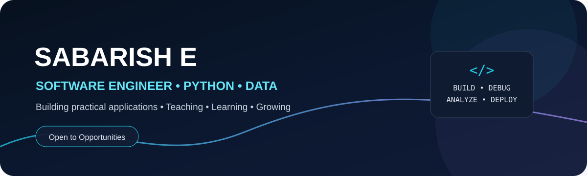
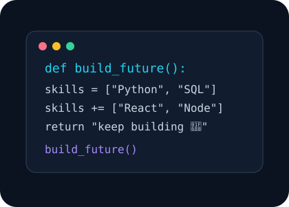

<div align="center">



<br/>


<p>
  
  
</p>

</div>

---

## 👋 Hi, I'm Sabarish E



🎓 **B.Sc. Computer Science | 2025 Graduate**  
💻 **Software Developer & Software Trainer**  
🧑‍🏫 **Software Trainer at Besant Technologies**  
🐍 Passionate about **Python & Backend Development**  
🌐 Interested in **Full Stack Web Development**  
⚛️ Currently strengthening my skills in **React, Next.js & Node.js**  
🗄️ Experienced in building applications with **MySQL & databases**  
🚀 Love building projects and sharing technical knowledge

### 🎯 What I Do

> **Build practical software, solve technical problems, and help others learn technology through hands-on development.**

<br clear="right"/>

---

## 💼 Professional Experience

### 🧑‍🏫 Software Trainer — Besant Technologies

**Software Trainer**

- 👨‍💻 Training students in software development technologies
- 🐍 Teaching Python programming and development concepts
- 🗄️ Training students in SQL & MySQL
- 🌐 Teaching web development fundamentals
- 💡 Explaining programming concepts through practical examples
- 🛠️ Helping students understand real-world development workflows
- 📚 Guiding learners through coding exercises and projects

---

## 🧰 Tech Stack

### 💻 Programming Languages

<p>

</p>

### ⚛️ Frontend Development

<p>

</p>

### ⚙️ Backend Development

<p>

</p>

### 🗄️ Database

<p>

</p>

### 🛠️ Tools & Platforms

<p>

</p>

---

## 🚀 Featured Projects

<table>
<tr>
<td width="50%">

### 🏥 MediLocate

Healthcare discovery platform with interactive maps.

**Built with:**  
`JavaScript` `Leaflet` `OpenStreetMap` `Overpass API`

**Highlights**

- 📍 Location-based search
- 🗺️ Interactive maps
- 🩺 Specialty filters
- 📏 Radius selection
- 📅 Booking interface

</td>

<td width="50%">

### 🎓 Student File Management

Final-year web application for student administration.

**Built with:**  
`PHP` `MySQL` `JavaScript` `HTML` `CSS` `XAMPP`

**Highlights**

- 👨‍🎓 Student information
- 📋 Attendance management
- 📚 Study materials
- 💳 Billing management
- 🗄️ MySQL database

</td>
</tr>

<tr>

<td width="50%">

### 🍔 FoodieHub

Restaurant / POS management application.

**Built with:**  
`React` `Node.js` `Express.js` `MySQL`

**Highlights**

- 🛒 Order management
- 🍽️ Product management
- 👥 Customer management
- 📊 Operational management

</td>

<td width="50%">

### 🏗️ Construction Monitoring

Database-driven construction monitoring application.

**Built with:**  
`React` `Node.js` `MySQL`

**Highlights**

- 📋 Task management
- 📈 Progress tracking
- 👷 Resource management
- 🗄️ Database integration

</td>

</tr>
</table>

---

## 🧠 What I'm Currently Learning

```text
React.js
   │
   ▼
Next.js
   │
   ▼
Node.js
   │
   ▼
Express.js
   │
   ▼
Advanced Backend Development
   │
   ▼
Full Stack Application Development
